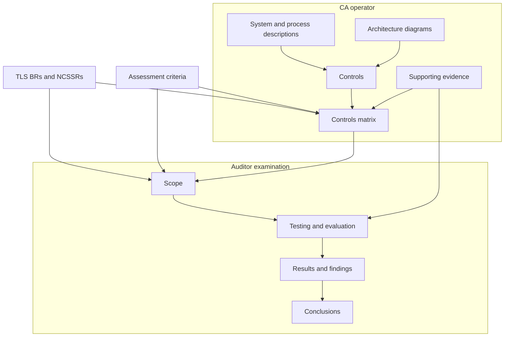

# **Detailed Controls Reports for Publicly Trusted Certification Authorities Issuing TLS Server Certificates: Purpose, Structure, and Benefits** 

**Mozilla Root Program White Paper**

**Version 1.0 – September 23, 2026**

## Table of Contents

- [Section 1 - Introduction](#section-1---introduction)
- [Section 2 - What is a DCR and how is it produced?](#section-2---what-is-a-dcr-and-how-is-it-produced)
  - [2.1 Relationship to Other Audits](#21-relationship-to-other-audits)
  - [2.2 Relationship to Management](#22-relationship-to-management)
- [Section 3 - Goals of the Detailed Controls Report](#section-3---goals-of-the-detailed-controls-report)
  - [3.1 System Design](#31-system-design)
  - [3.2 Controls to Address Criteria and Mitigate Risks](#32-controls-to-address-criteria-and-mitigate-risks)
  - [3.3 Testing and Verification](#33-testing-and-verification)
  - [3.4 Operational Effectiveness](#34-operational-effectiveness)
  - [3.5 Control Deficiencies](#35-control-deficiencies)
- [Section 4 - DCR Structure and Contents](#section-4---dcr-structure-and-contents)
  - [4.1 Executive Summary](#41-executive-summary)
  - [4.2 System Description (CA-provided)](#42-system-description-ca-provided)
    - [4.2.1 Scope and Boundaries](#421-scope-and-boundaries)
    - [4.2.2 Organizational Structure and Roles](#422-organizational-structure-and-roles)
    - [4.2.3 PKI Hierarchy](#423-pki-hierarchy)
    - [4.2.4 Major System Components](#424-major-system-components)
    - [4.2.5 Certificate Lifecycle](#425-certificate-lifecycle)
    - [4.2.6 Key and Cryptographic Operations](#426-key-and-cryptographic-operations)
    - [4.2.7 Third-Party Dependencies](#427-third-party-dependencies)
    - [4.2.8 Data Flows and Trust Boundaries](#428-data-flows-and-trust-boundaries)
    - [4.2.9 Security and Change Management Overview](#429-security-and-change-management-overview)
    - [4.2.10 Monitoring and Compliance Functions](#4210-monitoring-and-compliance-functions)
    - [4.2.11 Significant Changes During the Audit Period](#4211-significant-changes-during-the-audit-period)
    - [4.2.12 List of Diagrams](#4212-list-of-diagrams)
  - [4.3 Controls Description (CA-provided)](#43-controls-description-ca-provided)
  - [4.4 Criteria-to-Control Matrix (CA-provided)](#44-criteria-to-control-matrix-ca-provided)
  - [4.5 Testing Methodology (Auditor-determined)](#45-testing-methodology-auditor-determined)
    - [4.5.1 Methodologies](#451-methodologies)
    - [4.5.2 Evidence](#452-evidence)
    - [4.5.3 Sampling](#453-sampling)
    - [4.5.4 Control Frequency](#454-control-frequency)
    - [4.5.5 Professional Judgment](#455-professional-judgment)
  - [4.6 Test Results and Operating Effectiveness (Auditor-determined)](#46-test-results-and-operating-effectiveness-auditor-determined)
  - [4.7 Exceptions and Deficiencies (Auditor-determined)](#47-exceptions-and-deficiencies-auditor-determined)
  - [4.8 Appendices and Reference Tables](#48-appendices-and-reference-tables)
- [Section 5 - Benefits of DCRs](#section-5---benefits-of-dcrs)
- [Section 6 - Frequently Raised Concerns](#section-6---frequently-raised-concerns)
  - [6.1 Relationship to Existing Audits](#61-relationship-to-existing-audits)
  - [6.2 Confidential Information](#62-confidential-information)
  - [6.3 Auditor Burden](#63-auditor-burden)
  - [6.4 Cost](#64-cost)
  - [6.5 Consistency and Flexibility](#65-consistency-and-flexibility)
- [Conclusion](#conclusion)

# Section 1 - Introduction

[Section 3.1.5](https://www.mozilla.org/en-US/about/governance/policies/security-group/certs/policy/#315-detailed-controls-reports) of the Mozilla Root Store Policy (MRSP) establishes requirements for Detailed Controls Reports (DCRs) intended to enhance transparency and assurance concerning the systems, processes, and controls that support compliance with the CA/Browser Forum's TLS Baseline Requirements (TLS BRs) and the Network and Certificate System Security Requirements (NCSSRs). Existing WebTrust reports and ETSI Audit Attestation Letters (AALs) provide valuable independent assurance regarding compliance, but generally communicate the scope and conclusions of an assessment without providing a detailed view of the CA Operator’s relevant operational controls or the auditor’s examination of those controls. 

A DCR supplements, rather than replaces, the existing assessment. The applicable requirements and assessment criteria determine the scope of the engagement and which systems, processes, and controls are relevant to it. The DCR does not establish a separate set of audit criteria, require examination of systems or activities outside that scope, or prescribe the sequence in which the auditor must perform the assessment. Within the scope of that existing criteria-based assessment, the DCR provides greater visibility into the CA Operator’s relevant operational controls, the relationship between those controls and the applicable requirements, and the auditor’s examination and testing of those controls.

To provide that visibility, a DCR brings together two complementary forms of documentation. Based on requirements, the CA Operator provides or identifies documentation of the relevant systems, processes, and operational controls, which may include system and process descriptions, architecture diagrams, control descriptions, criteria-to-control mappings, and supporting evidence. The auditor separately documents the scope of the engagement, the examination procedures performed, the results obtained, any findings identified, and the conclusions reached. In other words, the applicable requirements and assessment criteria determine which systems, processes, and controls are relevant to the engagement. The organization of the DCR’s components does not prescribe the sequence in which the auditor must perform the assessment or alter an existing requirements-based assessment methodology. Also, such materials need not be jointly authored or presented in a single newly created report; they may consist of separate, clearly identified and cross-referenced components, including existing documentation that contains the expected information. Together, the components provide a more complete understanding of how the applicable requirements are implemented and how that implementation was evaluated.

The DCR therefore brings together the CA Operator's management documentation and the auditor's assurance documentation, with each party responsible for the information that falls within its respective expertise and responsibilities. 

***Note:** Throughout this paper, different terms are used to describe different aspects of the CA's control environment. For purposes of this paper, the control environment includes the governance structures, systems, processes, controls, monitoring activities, and oversight mechanisms that support operation of the CA. References to systems, controls, risks, testing activities, evidence, compliance activities, and related concepts are used where discussion is focused on those particular elements of the overall control environment.*

The CA Operator is expected to prepare comprehensive documentation describing its systems, processes, controls, diagrams, and control mappings before or during the audit process. This documentation serves as the foundation for the auditor's examination rather than requiring the auditor to independently develop detailed descriptions of the CA's operational environment.

Because the CA Operator must obtain a DCR for each applicable audit period and may later be required to provide it to Mozilla, relevant DCR information needs to be considered when the scope of the engagement is being discussed. The CA Operator should inform the auditor of the DCR requirement and determine how the CA Operator’s documentation and the auditor’s expected reporting will collectively provide the information described in this paper. Any gaps should be identified and addressed before the engagement and its reporting are completed. This advance planning concerns the documentation and reporting resulting from the engagement; it does not expand the applicable audit criteria, require an assessment of the CA’s entire operational environment, create a separate assurance engagement, or require Mozilla to approve the reporting arrangement in advance.

DCRs are intended to help CA management better understand and evaluate the effectiveness of the organization's control environment, identify opportunities for improvement, and strengthen ongoing compliance efforts. 

While auditors already perform testing, inspection, observation, inquiry, and other examination procedures as part of existing assurance engagements, the DCR framework introduces a structured and consistent approach for documenting the relationship between compliance criteria, implemented controls, and auditor testing procedures. 

The DCR framework is not intended to prescribe or diminish the auditor's professional judgment. Auditors are expected to apply the knowledge, experience, and discretion required by their professional standards in determining the nature, timing, and extent of examination procedures appropriate for each engagement. The additional documentation provided by a DCR is intended to make the relationship between criteria, controls, testing, and conclusions more transparent—not to substitute documentation requirements for professional expertise.

This additional level of transparency is intended to provide CA management, auditors, and root store operators with greater visibility into how compliance is achieved and maintained in practice.

# Section 2 - What is a DCR and how is it produced?

A DCR is the combined result of the CA Operator's documentation of its systems, processes, and controls, together with the auditor's independent examination and assurance over those controls. While the DCR is typically delivered at the conclusion of an audit engagement, it is built from complementary documentation produced by both the CA Operator and the auditor throughout the engagement. It documents how the CA Operator addresses the applicable criteria and how compliance with those criteria is evaluated. The DCR requirement is not simply to produce a longer audit report. Rather, it establishes a structured controls framework in which the CA Operator documents how compliance is achieved and the auditor independently evaluates whether those documented controls are suitably designed and operating effectively. The report is the artifact that combines these complementary contributions into a single, traceable record. 

Under the ETSI audit scheme, the information comprising a DCR is developed through the two-stage conformity assessment process set forth in section 7.4.4 of ETSI EN 319 403-1. In Stage 1, the CA Operator provides documentation identifying where applicable requirements are addressed and the relevant controls through which they are implemented. The auditor reviews that documentation to understand CA operations, evaluate its sufficiency, identify areas of concern, and plan Stage 2. In Stage 2, the auditor evaluates the CA operations and controls through on-site observation, examination of records and other evidence, and assessment against the TLS BRs, other applicable criteria, and the CA Operator’s own policies and procedures. DCR reporting expectations do not alter this process or prescribe how an ETSI auditor should conduct either stage. The distinction between CA Operator documentation and auditor assurance documentation is functional rather than chronological: CA Operator documentation informs both stages, while the auditor’s planning, evaluation, and reporting activities extend across the assessment.

An ETSI-based DCR may therefore consist of a coordinated collection of documents rather than a single report. It may include the CA Operator’s documentation and control information; an ETSI scope report describing the trust service, organizational and technical environment, assessment scope, and summary results; detailed requirement-level reports or annexes documenting the Stage 1 and Stage 2 work; and the Audit Attestation Letter, which may serve as an Executive Summary. These materials may be provided as separate, clearly identified and cross-referenced components, and no component needs to repeat information adequately presented in another.

The chart below illustrates how CA documentation and auditor examination come together to produce a DCR. The following terms used in the chart have the meanings specified below:

**Applicable Requirement:** An individual normative obligation applicable to the CA Operator and contained in a CA/Browser Forum document, root-store policy, assessment standard, or other authoritative source.

**Assessment Criteria:** The requirements or other benchmarks against which the auditor evaluates the subject matter of the engagement. Depending on the applicable assurance framework, an assessment criterion may be an underlying normative requirement or may incorporate or reference one or more such requirements. For instance, with ETSI, assessment criteria are not necessarily a separate intermediate layer of auditor-created control statements—the normative requirement may itself serve directly as the criterion against which the CA’s controls are assessed.

**Control:** A policy, procedure, technical mechanism, organizational measure, or other operational activity implemented by the CA Operator to satisfy one or more applicable requirements or address an associated risk.

**Controls Matrix:** A structured, criteria-to-controls mapping showing the relationship between the applicable requirements or assessment criteria and the CA Operator’s operational controls, together with references to relevant documentation, evidence, and auditor examination information. While this paper uses the term “Controls Matrix,” this criteria-to-control mapping need not be prepared as a separate document or in a prescribed format. An existing requirements list, assessment workbook, control matrix, or similar document may be used if it clearly identifies the applicable requirements, the CA Operator’s corresponding operational controls, and the locations of the supporting descriptions, evidence, and examination results. An ETSI-audited CA Operator may, for example, build upon the requirements-based documentation already used during Stage 1 of the assessment.

The DCR brings together two complementary forms of documentation: the CA Operator's documentation of its systems, processes, controls, and supporting evidence, and the auditor's documentation of the scope, examination, results, findings, and conclusions. Together, these provide traceability from applicable requirements to controls and evidence, and from those controls to independent assurance regarding their operation.

The DCR process begins with the CA identifying and documenting the systems, processes, and controls relied upon to satisfy the applicable criteria. The CA's documentation includes system and process descriptions, control descriptions, diagrams as appropriate, and a Controls Matrix. The Controls Matrix maps each criterion to one or more controls, identifies the systems or processes in which the controls operate and the evidence supporting their operation, and provides traceability between the applicable criteria, implemented controls, and supporting evidence. The auditor then independently evaluates the controls through procedures such as inspection, inquiry, observation, reperformance, and testing. The auditor uses professional judgment to determine the nature, timing, and extent of procedures appropriate to the engagement and to assess whether the controls are suitably designed and operating effectively to support compliance with the applicable criteria. 

The resulting DCR brings together the CA Operator’s documentation of its relevant systems, processes, and operational controls, including supporting evidence or references to that evidence, with the auditor’s documentation of the examination. The CA Operator is responsible for ensuring that the DCR is assembled and made available as a complete and navigable package. This includes preparing or identifying the relevant CA Operator documentation, mapping the applicable requirements or other assessment criteria to the relevant operational controls, and providing clear cross-references among the components. The auditor remains responsible for documenting the scope of the engagement, the examination procedures performed, the results obtained, any findings identified, and the conclusions reached. These responsibilities do not require the CA Operator and auditor to jointly author a single report or either party to assume responsibility for the other party’s work.

## 2.1 Relationship to Other Audits

DCRs are intended to complement, not replace, existing WebTrust and ETSI audit reports. Regardless of the audit framework used, auditors are already required to evaluate compliance with the TLS Baseline Requirements and the Network and Certificate System Security Requirements as part of the annual audit engagement. The DCR framework is designed to operate alongside those existing assurance activities by providing a more structured and detailed view of the controls, evidence, and testing supporting compliance. The DCR framework does not require auditors to adopt a separate methodology or reporting framework; rather, it identifies the information that should be available to demonstrate the relationship between applicable criteria, the CA's controls, and the auditor's examination and conclusions.

Mozilla anticipates that DCR activities will be performed as part of, or contemporaneously with, already-existing annual audit processes. When submitting audit documentation through the CCADB, CA Operators will attest that a DCR was completed and provided to management. By documenting the controls relied upon to achieve compliance and the procedures used to evaluate them, DCRs provide additional transparency into the basis for the auditor's conclusions and may increase confidence in the overall assurance process.

## 2.2 Relationship to Management 

Although Mozilla requires DCRs as a condition of participation in the Mozilla Root Program, the primary audience for a DCR is the CA Operator's management. Other audiences may include auditors, root store operators, CA customers, and other governance, risk, and compliance stakeholders who may benefit from the information contained in a DCR. However, the report is principally intended to support management's understanding of the systems, processes, controls, and risks associated with operating a publicly trusted CA.

Effective compliance requires active management oversight and accountability. By providing a structured description of the controls relied upon to satisfy applicable requirements, together with information regarding their design, operation, and testing, DCRs can help management evaluate the effectiveness of the CA's relevant control environment, identify areas for improvement, and make informed decisions regarding risk and compliance.

The DCR requirement also reinforces the importance of establishing a strong "tone at the top." Management attention to compliance expectations, operational discipline, and continuous improvement helps promote a culture in which compliance responsibilities are understood and supported throughout the organization.

# Section 3 - Goals of the Detailed Controls Report

The purpose of a DCR is to provide CA management and other stakeholders with sufficient information to understand system design, operations, controls that support compliance, and how compliance is evaluated. A well-prepared DCR should enable management and other readers to understand system design, controls, testing, operational effectiveness, and control deficiencies.

## 3.1 System Design

A DCR should provide a sufficiently thorough description of the portions of the CA system relevant to the applicable requirements and within the scope of the engagement. The description should identify the CA hierarchies and services in scope and explain the major infrastructure, software, processes, personnel roles and responsibilities, trust boundaries, data flows, and third-party relationships involved in certificate issuance, management, and revocation or otherwise supporting satisfaction of the applicable requirements. It should give readers enough context to understand how the components of the system interact, where relevant controls operate, and how the implementation was evaluated. The level of detail should reflect the nature and complexity of the CA system. The objective is to describe the relevant system thoroughly, without requiring an inventory of every component or every technical configuration detail.

The same approach can accommodate changes in certificate architecture. If an applicable audit or reporting framework addresses Merkle Tree Certificates or similar models, the system description should identify the roles and trust relationships relevant to that engagement. These may include CA cosigners, issuance logs, and independently operated mirroring cosigners. The description should explain which functions the CA Operator performs, which it relies on others to perform, and what controls operate at those boundaries. It should also make clear which functions are within the scope of the engagement and how they are evaluated against the applicable requirements.

## 3.2 Controls to Address Criteria and Mitigate Risks

Controls are the mechanisms through which compliance requirements are implemented and risks are managed. Controls do not exist in isolation. They are implemented to satisfy applicable requirements and to reduce the likelihood or impact of risks that could result in non-compliance, security incidents, operational failures, certificate misissuance, delayed revocation, unauthorized access, or other adverse outcomes. Controls may address risks associated with certificate issuance, validation, revocation, key management, access control, software changes, third-party dependencies, and other activities relevant to the operation of a publicly trusted CA.

A DCR should identify the controls implemented to satisfy applicable requirements and mitigate identified risks. These controls may be technical, procedural, physical, administrative, or organizational in nature. Readers should be able to understand how each control contributes to meeting one or more requirements, managing relevant risks, and supporting the overall effectiveness of the CA's relevant control environment.

## 3.3 Testing and Verification

A DCR should describe the procedures performed to evaluate whether the controls functioned as intended. Depending on the nature of the control, these procedures may include inspection, observation, inquiry, reperformance, examination of evidence, automated testing, or other verification activities. The DCR should provide enough information for readers to understand the basis for the auditor's conclusions; it is not intended to prescribe the auditor's examination methodology.

## 3.4 Operational Effectiveness

A DCR should provide information regarding whether the controls operated effectively throughout the audit period and whether they provided reasonable assurance that the applicable criteria were met. The focus is not merely whether a control exists. Unlike an assessment of control design alone, operational effectiveness considers whether the controls were actually executed, monitored, and sustained over time.

## 3.5 Control Deficiencies

A DCR should disclose any significant control deficiencies identified during the examination, together with management's corrective actions or remediation plans where appropriate. Understanding identified weaknesses and how they were addressed provides important context regarding the overall effectiveness and maturity of the control environment.

# Section 4 - DCR Structure and Contents

***Note:** The structure described in Section 4 is illustrative, not mandatory, and represents one possible approach to organizing a DCR. A DCR need not consist of a single, newly prepared document or follow a prescribed format. Alternative structures and formats may be equally appropriate, provided that they communicate the information necessary to understand the relevant CA systems, processes, controls, and risks; their relationship to the applicable requirements or other assessment criteria; and the auditor’s examination, findings, and conclusions. Existing CP/CPS material, internal system and process documentation, architecture diagrams, requirements lists, assessment workbooks, control mappings, auditor reports, and other assurance documentation may be included, incorporated, or cross-referenced where they contain the expected information. Each component should be clearly identified, and its applicability to the scope and period of the engagement should be apparent. Materials necessary to understand the DCR should be included or otherwise made accessible to an authorized reviewer. Underlying workpapers or evidence do not become DCR components merely because they are referenced or relied upon by the auditor. Cross-references should allow the reviewer to trace how each applicable requirement or other assessment criterion relates to the relevant operational controls and supporting documentation or evidence, and how those controls were examined and evaluated.*

A DCR should not be viewed merely as a giant controls matrix or compliance checklist. While traceability between criteria, controls, testing procedures, and results is an important aspect of the DCR, the broader objective is to provide management and other stakeholders with a meaningful understanding of the systems, controls, testing activities, operational effectiveness, and control deficiencies relevant to compliance. A matrix helps map controls to criteria and track tests and results, but cannot by itself answer questions that call for narrative explanation, such as: 

- What systems are in scope? 
- How does this CA actually operate? 
- What are the important risks? 
- What controls are relied upon? 
- Why should I believe these controls are effective? 
- Were any significant weaknesses discovered? 

In other words, if the matrix disappeared but the narrative remained, a reader would still be able to understand the DCR, but if the narrative disappeared and the matrix remained, a reader would struggle to understand the DCR.

A DCR need not be a single, newly authored document or follow a prescribed format. Existing CP/CPS material, internal system and process documentation, architecture diagrams, requirements lists, assessment workbooks, control mappings, auditor reports, and other assurance documentation may be included or cross-referenced where they contain the expected information. The components should be clearly identified, applicable to the period and scope of the engagement, available to the intended recipient, and organized with sufficiently precise cross-references to allow the relationships among the applicable requirements, operational controls, supporting evidence, auditor examination, and results to be readily understood.

## 4.1 Executive Summary

An Executive Summary is optional. Where included, it may provide management and other readers with a concise overview of the CA environment, scope of the examination, significant controls evaluated, testing performed, significant deficiencies or exceptions identified, and the auditor's overall conclusions. The Executive Summary should highlight the most important information contained in the DCR and enable readers to understand the overall results of the examination without reviewing the entire report. A separate Executive Summary may be unnecessary if this information is adequately summarized in an existing report, such as a WebTrust report or ETSI AAL, or if another component of the DCR already provides an appropriate summary of the engagement and its overall results. 

Sections 4.2 through 4.4 describe documentation provided by or derived from CA management, while Sections 4.5 through 4.7 describe the auditor's independent examination and assurance work. The resulting DCR may combine these components in a single report or present them as related sections or documents.

## 4.2 System Description (CA-provided)

*What systems and services are in scope, how do they operate together, who is responsible for them, and where do the relevant controls operate?*

The CA Operator should provide a sufficiently detailed description of the system within the scope of the DCR. This description should identify the CA hierarchies and services covered and explain the infrastructure, software, personnel, processes, trust boundaries, data flows, and third-party services relevant to the applicable requirements. It should show how these elements fit together so that readers can understand the environment in which the controls operate and the activities the auditor evaluated. The necessary depth will vary with the complexity of the system; a brief overview may not be sufficient for a complex CA environment. The system description may identify the location and purpose of important controls, but the controls matrix will provide the detailed account of those controls and their relationship to the applicable requirements. 

Furthermore, the CA Operator is responsible for preparing the system description and ensuring that it is accurate and sufficiently complete for the engagement. In reviewing it, the auditor may identify unclear, missing, or inconsistent information and communicate those concerns to the CA Operator, subject to the applicable audit methodology and independence requirements. The CA Operator is responsible for any revisions; the auditor does not prepare the description or prescribe how identified gaps must be resolved. If the information remains insufficient to plan or perform the assessment, the relevant audit work should not proceed until the CA Operator addresses the deficiency.

### 4.2.1 Scope and Boundaries

This section should enable the reader to understand:

- Which legal entity is being examined. 
- Which CA hierarchies are in scope. 
- Which facilities are in scope. 
- Which cloud providers are in scope. 
- Which outsourced functions are in scope. 
- Which systems are excluded. 

Examples:

- Registration Authority systems 
- Issuing CA systems 
- HSM infrastructure 
- Subscriber portals, interfaces, APIs 
- Validation platforms 
- Revocation infrastructure 
- CT submission systems 

Diagrams may be helpful here.

### 4.2.2 Organizational Structure and Roles

This need not be an organizational chart listing every employee, but it should identify the following roles and groups:

- Trusted roles 
- Security team 
- Compliance team 
- Operations team 
- Registration staff 
- Key ceremony participants 

This helps readers understand separation of duties.

### 4.2.3 PKI Hierarchy

Readers should be able to understand the PKI hierarchy, trust relationships, and certificate types. For example, this could consist of a graphical representation of:

Root CA
     |
Issuing CA
     |
TLS Certificates

### 4.2.4 Major System Components

The objective is to provide architectural understanding of the CA environment, including the major systems, their roles, their relationships, and the controls that operate within them, rather than to exhaustively list underlying infrastructure, such as IP addresses, VLAN configurations, firewall rules, router configurations, individual server names, switch topologies, or load-balancing configurations.

Example:

Subscriber
      |
Web Portal
      |
Validation Platform
      |
Issuance Platform
      |
HSM
      |
Certificate Repository

### 4.2.5 Certificate Lifecycle

Process-flow diagrams may be helpful here.

**Request**

- CSR submission 
- API submission 
- ACME 

**Validation**

- Domain validation 
- Organization validation 
- CAA checking 
- MPIC 

Validation activities may include domain control validation, organization validation, CAA checking, MPIC, and other verification procedures. Automated and manual controls may be used to ensure that validation requirements are satisfied and that issuance cannot proceed unless validation has been successfully completed. 

**Issuance**

- Approval workflow 
- Signing operations 
- CT submission 

The issuance process authorizes and generates certificates following successful completion of validation activities. Controls within this process may include issuance authorization workflows, automated policy enforcement, certificate linting, signing controls, certificate transparency submission, logging, and audit trail generation.

**Delivery**

- Certificate delivery 
- Logging 

**Revocation**

- CPR intake 
- Revocation decisions 
- CRL generation 
- OCSP updates 

Controls may include certificate problem report (CPR) intake procedures, revocation decision workflows, authorization controls, CRL generation, OCSP updates, monitoring activities, and escalation procedures designed to ensure timely revocation when required.

### 4.2.6 Key and Cryptographic Operations

Readers should be able to understand:

- Key generation 
- Key storage 
- HSM usage 
- Key activation 
- Key backup 
- Key destruction 

The description should provide enough detail to understand the controls without compromising security.

### 4.2.7 Third-Party Dependencies

Third-party dependencies can introduce significant compliance and operational risks and should therefore be described where relevant. Examples:

- Cloud hosting providers 
- HSM vendors 
- Managed service providers 
- Registration Authorities 
- Validation partners 
- CT logs 
- DNS providers 

### 4.2.8 Data Flows and Trust Boundaries

A network and trust boundary diagram may show logical zones and major interfaces, including cloud trust boundaries, if any.

Internet
    |
DMZ
    |
Validation Network
    |
Issuance Network
    |
Offline CA Environment

### 4.2.9 Security and Change Management Overview

Provide this at a high level only, without detailed procedures, and just enough context to understand where relevant controls exist.

Example topics:

- Access management 
- Vulnerability management 
- Change approval process 
- Incident response process 

### 4.2.10 Monitoring and Compliance Functions

This is especially important because DCRs are about controls.

The DCR should explain:

- How controls are monitored. 
- Who reviews exceptions. 
- How incidents are escalated. 
- How compliance is measured. 

### 4.2.11 Significant Changes During the Audit Period

The description should identify any changes having major implications for control testing. Examples include:

- Migration to a new issuance platform. 
- A new cloud environment. 
- A new RA partner. 
- HSM replacement. 

### 4.2.12 List of Diagrams

- PKI/Certificate Hierarchy
- System Architecture: Major systems and trust boundaries.
- Certificate Lifecycle Processes: Request → Validation → Issuance → Revocation.
- Network / Trust Boundary Diagram: Logical zones and major interfaces.
- Organizational / Responsibility Diagram: Trusted roles and oversight functions.

## 4.3 Controls Description (CA-provided)

The System Description explains what exists and how the CA operates, whereas the Controls Description explains how risks are managed and how compliance is achieved.

What is a control? A control is any measure designed to reduce risk or provide reasonable assurance that applicable criteria are met. While some controls are procedures performed by individuals, many controls are implemented through technology, system design, or physical safeguards. Preventive controls may be embedded within software, automated workflows, or system configurations to prevent unauthorized or improper actions from occurring. Monitoring systems, logging mechanisms, and alerting processes often function as detective controls by identifying anomalies or potential failures. Physical safeguards, such as locks, access badges, and surveillance systems, serve as physical controls. Human-based controls may include reviews, approvals, reconciliations, oversight activities, and governance processes. Effective control environments typically rely on a combination of automated, physical, and human controls working together to manage risk.

The purpose of the Controls Description is to identify and explain the controls relied upon to satisfy applicable requirements and mitigate relevant risks. Controls descriptions should provide sufficient information for readers to understand the risks being addressed, the design and operation of the controls, the responsible parties, and the circumstances under which the controls are performed. They should also provide a sufficient basis for the auditor to determine and perform examination procedures appropriate to the engagement. The Controls section is intended to explain how risks are managed within the CA environment rather than provide a comprehensive mapping of controls to applicable criteria. 

The CA Operator is responsible for preparing and maintaining traceability among the applicable requirements, the policies and procedures in which those requirements are addressed, the controls through which they are implemented, and the auditor’s examination and results. For each applicable requirement, or logically related group of requirements, the CA Operator should identify the relevant documentation, controls, processes, systems, responsibilities, and evidence that demonstrate implementation.

This information need not be presented in a document specifically titled a “criteria-to-control matrix” and may be distributed among clearly cross-referenced components of the DCR. An existing requirement-level matrix or audit report may satisfy this objective if it identifies with sufficient clarity the applicable requirement, the relevant CA Operator documentation and controls, the evidence or samples considered, the procedures performed, the auditor’s result, and any associated finding. A reference to a policy or other document, or a conformity verdict alone, does not sufficiently explain how a requirement is implemented and examined.

For an ETSI assessment, the CA Operator may use a Stage 1 matrix or other requirement-level template provided by the auditor as the starting point for this traceability. The CA Operator should supplement document references with sufficient information to identify the relevant controls. The auditor independently evaluates the sufficiency of the CA Operator’s documentation during Stage 1 and examines the implementation and operation of the relevant controls during Stage 2, documenting the evidence considered, procedures performed, results, and associated findings.

The DCR should distinguish between the CA Operator's description of its controls and the auditor's independent examination of those controls. The following illustrates how these complementary components of the DCR may be presented:

**CA Operator's Control Description**

The certificate issuance management system is integrated with our centralized identity management platform. All users authenticate using individually assigned organizational accounts. Shared accounts are prohibited.

Authentication requires: a unique username and password meeting corporate password complexity requirements; multi-factor authentication using a FIDO2 security key or approved authenticator application; and encrypted communications using TLS.

Access rights are assigned using role-based access control (RBAC). Roles are defined according to job responsibilities and include Registration Authority Operator, Certificate Approver, Issuance Administrator, Security Administrator, Auditor, and Read-Only Reviewer.

Requests for privileged access must be submitted through a ticketing system, identify a business justification, and be approved by the employee's manager and the CA Security Manager before provisioning.

Access provisioning is performed by authorized identity-management personnel and is documented within the ticketing system.

Privileged access group membership is reviewed quarterly by the CA Security Manager. Review procedures include verification that access remains necessary for assigned job duties, segregation-of-duties requirements remain satisfied, and no terminated or transferred personnel retain access.

Access for terminated personnel is automatically disabled through integration with the human resources system. Access for transferred personnel must be reviewed and adjusted within five business days of personnel changes.

The issuance management system records the following security-relevant events:

- Successful and failed authentication attempts.
- Privilege assignments and removals.
- Changes to system configuration.
- Certificate issuance, revocation, and approval actions.
- Administrative actions affecting issuance workflows.

Logs are transmitted to a centralized security information and event management (SIEM) platform where they are protected from modification and retained for a minimum of two years.

Security personnel perform weekly reviews of privileged administrative activity and investigate anomalies, including unauthorized access attempts, unusual issuance volumes, after-hours administrative activity, and changes to privileged group memberships. Evidence of reviews is retained within the ticketing or monitoring system.

**Auditor's Examination and Result**

The auditor inspected the issuance management system's access-control configuration, examined a sample of privileged-access requests and periodic access reviews, and reviewed relevant authentication and administrative activity logs. The auditor also evaluated the operation of automated provisioning and deprovisioning controls. Based on the procedures performed, the auditor concluded that the controls were suitably designed and operated effectively during the audit period, with no exceptions identified.

A DCR should not merely document that a control exists; it should describe the control as it is truly implemented. In many modern CA environments, several controls, such as software, automation, system design, monitoring, and human oversight, are combined. So, rather than simply saying, "domain validation is performed before certificate issuance," a more meaningful control description might say,

*The risk of unauthorized certificate issuance is mitigated through an automated domain validation system that performs validation using approved methods before a certificate can be issued. The system incorporates controls designed to improve the reliability and security of the validation process, including automated verification of CAA records, Multi-Perspective Issuance Corroboration (MPIC), validation data integrity checks, and issuance workflow restrictions that prevent certificate issuance unless all required validation steps are successfully completed. The system produces validation records, audit logs, and issuance transaction records that provide evidence that successful validation has occurred. Specific, identified personnel are responsible for monitoring the system, investigating exceptions, and managing changes to validation procedures. If any validation requirement cannot be satisfied, certificate issuance is automatically blocked until the condition is resolved.*

Control descriptions should be organized in a manner that promotes an understanding of the CA's control environment and facilitates mapping to applicable audit criteria. Many organizations find it useful to group controls into logical categories, such as governance, personnel security, physical security, logical access, key management, certificate lifecycle management, change management, logging and monitoring, business continuity, and incident response. However, other organizational approaches may be appropriate depending on the CA's systems, documentation practices, and audit methodology.

While organizing controls by category is generally recommended because it provides a clearer understanding of the CA's overall control environment, other organizational approaches may be appropriate, such as organization by control domain, operational process, system component, or audit criterion. Regardless of the organizational method selected, the DCR should enable readers to understand how compliance risks are mitigated and, as discussed in the next section, provide a clear mapping between applicable criteria and the controls that address them.

Here is an example of a category-based list of controls:

**Governance and Oversight Controls**

- Policies and procedures 
- Compliance reviews 
- Internal audits 
- Management review meetings 
- Risk assessments 
- Annual self-assessments 

**Personnel Controls**

- Background screening 
- Trusted role vetting 
- Security awareness training 
- Separation of duties 
- Dual control 
- Mandatory vacations (where applicable) 

**Physical Security Controls**

- Data center access controls 
- Badge systems 
- Biometric authentication 
- Security guards 
- CCTV monitoring 
- Visitor logging 

**Logical Access Controls**

- Multi-factor authentication 
- Role-based access control 
- Privileged access management 
- Password controls 
- Account provisioning and deprovisioning 
- Periodic access reviews 

**Cryptographic Controls**

- HSM-enforced key protection 
- Key generation ceremonies 
- Dual control for key activation 
- Key backup controls 
- Key destruction procedures 
- Algorithm and parameter validation 

**Certificate Lifecycle Controls**

 - **Validation Controls**
   - Domain validation procedures
   - MPIC
   - CAA checking
   - Organization validation
   - Validation reuse controls
 - **Issuance Controls**
   - Pre-issuance linting
   - Approval workflows
   - Issuance authorization controls
   - CT logging controls
 - **Revocation Controls**
   - CPR intake
   - Revocation authorization
   - CRL generation
   - OCSP updates
   - Revocation monitoring

**Change Management Controls**

- Code review 
- Pull request approval 
- Segregation of development and production 
- Testing requirements 
- Change approval boards 
- Emergency change procedures 

**Software Development Controls**

- Secure coding standards 
- Static analysis 
- Dependency scanning 
- Vulnerability management 
- Release management 

**System Operations Controls**

- Monitoring     
- Alerting     
- Log review 
- Capacity management 
- Backup verification 
- System health checks 

**Network Security Controls**

- Firewalls     
- Network segmentation 
- IDS/IPS 
- DDoS protections 
- VPN controls 
- Secure administration channels 

**Business Continuity Controls**

- Redundant power 
- Redundant connectivity 
- Disaster recovery plans 
- Backup sites 
- Failover testing 
- Business continuity exercises 

**Incident Response Controls**

- Security event monitoring 
- Escalation procedures 
- Incident reporting 
- Root cause analysis 
- Corrective action tracking 

**Third-Party Management Controls**

- Vendor due diligence 
- Contract reviews 
- Annual vendor assessments 
- Monitoring of outsourced functions 
- Cloud provider oversight

The Controls Description section and the Criteria-to-Control Matrix serve different purposes and should minimize duplication—otherwise, someone will have to enter the same information multiple times in different layouts. The DCR should also clearly communicate how controls are applied to the systems and processes within scope. Depending on the complexity of the environment, this might be accomplished through narrative descriptions, diagrams, a systems-to-controls matrix, or a combination of these approaches.

A CA may maintain detailed internal control documentation, such as a control register or a Risk and Control Matrix. The DCR would ordinarily summarize relevant information from such documentation at a level appropriate for the report rather than reproduce the full level of detail maintained in the CA's underlying control documentation.

For example, the CA's underlying control documentation for an individual control might include the following information:

**CTRL-017 – Domain Validation Authorization**

**Risk Addressed:** Unauthorized issuance of certificates for domains not controlled by the subscriber.

**Control Owner:** Validation Operations Manager.

**Frequency:** Per certificate request.

**Control Description:** Prior to issuance, the validation platform performs automated domain validation using approved methods. The platform verifies successful completion of validation before issuance may proceed.

**Evidence Produced:** Validation transaction records, domain control verification logs, issuance approval records, and associated audit logs.

**Control Type (if applicable):** Preventive, detective, or corrective.

While a DCR is derived from that underlying documentation, it does not need to reproduce every metadata field or other detail maintained by the CA. Instead, the DCR might summarize the control and the auditor's examination as follows:

*The CA performs automated domain validation using approved methods prior to certificate issuance. The auditor inspected the validation configuration, examined a sample of validation records, and verified that certificates were issued only after successful completion of domain validation.*

In other words, the DCR would summarize the control rather than reproduce the entire internal control catalog.

## 4.4 Criteria-to-Control Matrix (CA-provided)

The Criteria-to-Control Matrix is distinct from the Controls Description and performs two main functions: it provides traceability between the applicable criteria and the controls relied upon to satisfy those criteria, and it provides a foundation that the auditor may use in planning and documenting examination and related reporting. The matrix serves as a roadmap connecting requirements, controls, testing activities, and examination results. It helps management, auditors, and other readers understand how compliance is achieved and where evidence of compliance can be found.

One danger is attempting to make a single matrix serve every purpose within the DCR. The Criteria-to-Control Matrix is intended to provide traceability between applicable criteria and the controls relied upon to satisfy those criteria. Auditors may subsequently use the same underlying framework to plan and document testing procedures, identify evidence examined, record testing results, evaluate operating effectiveness, and document any exceptions or deficiencies.

Each applicable requirement or other assessment criterion within the scope of the engagement should be identifiable in the mapping. The DCR need not repeat the same control description, supporting documentation or evidence, examination procedure, or result for every requirement to which it relates. Related requirements may be grouped, and information shared among multiple requirements or controls may be described once and incorporated through precise cross-references, provided that the mapping remains complete and allows the reader to determine which requirements, controls, examination procedures, results, and findings correspond to one another. Any exception or finding should be attributable to the affected requirement or control.

While it may be practical to maintain a single comprehensive spreadsheet or database throughout the examination, presenting all of this information in a single report table can become unwieldy and difficult to understand. A matrix that simultaneously contains criteria references, full criteria text, control mappings, evidence references, testing procedures, sampling information, results, conclusions, and exceptions may become unnecessarily complex and reduce readability.

Accordingly, it may be preferable for a DCR to present separate but related tables or views. For example, one table may focus on the relationship between criteria and controls, while subsequent tables document testing procedures, evidence examined, results, operating effectiveness conclusions, and any identified deficiencies. Consistent use of criterion identifiers, control identifiers, test identifiers, and exception identifiers can provide traceability across these sections while allowing each table to remain focused on its intended purpose.

To improve readability and provide context, the Criteria-to-Control Matrix may include a brief criterion summary in addition to the criterion reference. Criterion summaries should concisely describe the substance of the applicable requirement without reproducing the full text of the corresponding TLS Baseline Requirements or Network and Certificate System Security Requirements provision. Where practical, criterion summaries should be written in a manner that helps readers understand both what the requirement mandates and the intended compliance outcome. This additional context can help explain why the associated controls are necessary without unnecessarily expanding the matrix.

Where appropriate, the matrix may also include references to the applicable CP/CPS sections that describe the CA's implementation of the criterion. Including these references can improve traceability by helping reviewers understand how documented policy commitments relate to implemented controls. Mozilla does not expect the matrix to reproduce CP/CPS text.

The example shown below is intentionally simplified for readability. Where additional horizontal space is available—for example, in a landscape-oriented section of the report—the matrix may be expanded to include additional columns, such as excerpts of relevant CP/CPS text, implementation summaries, control owners, or other information that improves traceability and reviewer understanding.

For example, the columns of a Criteria-to-Control Matrix might look like this:

| **Criterion   Reference** | **Criterion   Summary**                                      | **CPS Ref.** | **Control   ID(s)** | **Control   Names**              | **Notes\***                                                 |
| ------------------------- | ------------------------------------------------------------ | ------------ | ------------------- | -------------------------------- | ----------------------------------------------------------- |
| TLS BR  3.2.2.4           | Verify that  the applicant controls the domain before certificate issuance. | CPS §4.2.1   | CTRL-017            | Domain  Validation Authorization | Automated and  manual validation controls operate together. |

\* Useful for describing limitations on scope, cross-references, partial applicability, or how multiple controls collectively satisfy a criterion.

The columns in an auditor’s testing matrix might look like this:

| **Criterion   Reference** | **Criterion   Summary**                                | **Control   ID** | **Test ID** | **Auditor Examination Procedures\***                         | **Result** |
| ------------------------- | ------------------------------------------------------ | ---------------- | ----------- | ------------------------------------------------------------ | ---------- |
| BR 3.2.2.4                | Verify  applicant control of domain prior to issuance. | CTRL-017         | TEST-017    | Examined  validation logs and approval records for a sample of 60 certificate requests  selected from the audit period. | Effective  |

\* A description of the evidence examined and procedures performed by the auditor, including, where applicable, sampling methodologies, sample sizes, observations, inspections, inquiries, reperformance activities, or other testing techniques used to evaluate the control.

## 4.5 Testing Methodology (Auditor-determined)

The existence of a documented control does not, by itself, demonstrate that the CA’s control was effective. Auditor testing evaluates whether controls have been appropriately implemented and whether they operated consistently throughout the audit period. The objective is to determine not only whether a control was designed to address a risk or requirement, but also whether it functioned as intended in practice. Auditor testing provides the evidentiary basis for conclusions regarding the effectiveness of the control environment and the degree of assurance that the applicable criteria were satisfied.

### 4.5.1 Methodologies

Auditors use a variety of examination procedures to evaluate whether controls were implemented and operated effectively during the audit period. The nature and extent of testing will vary depending on the type of control being examined, the associated risks, the frequency with which the control operates, and the auditor's professional judgment.

Depending on the engagement and applicable assurance framework, examination procedures may include examining records, logs, reports, tickets, configurations, and other evidence produced by the control; observing personnel perform procedures; interviewing personnel regarding the operation of the control; independently reperforming selected activities to verify results; and reviewing automated system functionality, configurations, or source code. Auditors may also use sampling techniques to select representative transactions, events, or records for examination when it is not practical or necessary to review every instance of a control's operation.

Different types of controls often require different testing approaches. For example, an auditor evaluating a quarterly access review may examine review records and supporting approvals, while an auditor evaluating an automated certificate issuance control may inspect system configurations, review issuance logs, and perform tests to verify that the control operates as intended. The objective is not merely to confirm that a control exists, but to obtain sufficient evidence to determine whether the control was functioning effectively throughout the audit period.

### 4.5.2 Evidence

Depending on the nature of the control, evidence may include system logs, validation records, approval records, access reviews, configuration settings, change requests, training records, incident reports, key ceremony documentation, monitoring reports, or other artifacts demonstrating that the control operated as intended.

### 4.5.3 Sampling

Auditors do not necessarily examine every instance of a control's operation during the audit period. Instead, auditors may use judgmental, statistical, risk-based, or other sampling approaches to select items for examination. The nature and extent of sampling are determined by the auditor based on professional judgment and applicable auditing standards.

### 4.5.4 Control Frequency

The frequency with which a control operates is one factor the auditor may consider in determining the nature and extent of examination procedures. Controls may operate continuously, for each transaction or event, daily, periodically, or in response to particular circumstances. For example, an automated validation control may operate for every certificate request, while an access review may be performed quarterly and a key ceremony may occur only when required.

The auditor should apply professional judgment, consistent with the applicable assurance framework, in determining how the frequency and nature of a control affect the examination procedures necessary to evaluate its operation during the audit period.

### 4.5.5 Professional Judgment

This white paper does not prescribe specific testing procedures, sample sizes, or examination methodologies. Auditors should exercise professional judgment and apply the requirements of the applicable assurance framework when determining the nature, timing, and extent of testing necessary to evaluate a control.

## 4.6 Test Results and Operating Effectiveness (Auditor-determined)

The preceding sections of the DCR explain the environment, requirements, controls, and evidence. The Test Results and Operating Effectiveness section explains how the auditor evaluated those controls and obtained the evidence necessary to reach conclusions regarding their effectiveness.

The purpose of the Test Results and Operating Effectiveness section is not merely to indicate whether controls passed or failed testing. Rather, the DCR should provide sufficient information for readers to understand the nature and extent of the auditor's examination, the evidence considered, the results obtained, and the conclusions reached. Readers should also be able to understand the significance of any exceptions, deficiencies, or limitations identified during the examination. The manner in which the auditor documents and presents this information may vary according to the applicable assurance framework and the auditor's professional judgment. 

For example, the auditor's examination documentation may identify or summarize what was examined, such as samples of transactions or events, system configurations, records, logs, reports, or other evidence; how the examination was performed, such as through inspection, observation, inquiry, reperformance, automated testing, sampling, or other procedures; and the results and conclusions reached, including any exceptions, deficiencies, or limitations identified. This information may be presented in a matrix or another format appropriate to the applicable assurance framework and the auditor's professional judgment. Where a matrix is used, criterion references or summaries, control and test identifiers, and other cross-references may be included to maintain traceability between the applicable criteria, controls, examination procedures, results, and conclusions.

CA management should be able to use this section of the DCR to evaluate whether the controls relied upon by the CA are functioning as intended and whether additional improvements may be warranted. Other readers would use this section to better understand the degree of assurance supporting the auditor's conclusions and the overall effectiveness of the control environment.

To recap, the DCR documents the chain of assurance from requirements to controls to auditor conclusions. The System Description provides context regarding the environment being examined. The Criteria-to-Control Matrix identifies the controls relied upon to satisfy applicable requirements. The Controls Description explains how those controls operate and the evidence they produce. The Test Results and Operating Effectiveness section describes the auditor's examination, evidence reviewed, results, and conclusions.

## 4.7 Exceptions and Deficiencies (Auditor-determined)

No control environment is perfect, and the existence of exceptions or deficiencies does not necessarily indicate that a system of controls is ineffective as a whole. The purpose of this section is to provide transparency regarding any exceptions, control deficiencies, deviations, limitations, or other matters identified during the examination that may affect the auditor's conclusions regarding operating effectiveness.

This section should describe the nature of any exceptions identified during testing, the controls affected, the significance of the issue, and any known impact on compliance with the applicable criteria. Where appropriate, the auditor may also describe compensating controls, management responses, corrective actions taken during the audit period, or planned remediation activities. Readers should be able to understand not only that an issue was identified, but also its context, severity, and relevance to the overall effectiveness of the control environment.

The absence of reported exceptions or deficiencies may indicate that no matters of significance were identified during the examination. Conversely, the presence of exceptions or deficiencies should not automatically be interpreted as evidence that the overall control environment was ineffective. Readers should consider the nature, frequency, scope, and severity of the issue, together with any compensating controls and the auditor's overall conclusions.

## 4.8 Appendices and Reference Tables

Appendices and reference tables may be used to provide supplemental information that supports the reader's understanding of the DCR while avoiding unnecessary complexity in the main body of the report. The purpose of these materials is to improve traceability, readability, and ease of reference without distracting from the narrative descriptions of the system, controls, testing, and results.

Examples of information that may be included in appendices or reference tables include glossaries of terms and abbreviations, inventories of control identifiers and test identifiers, detailed system diagrams, organizational charts, mappings between criteria and controls, references to policies and procedures, descriptions of evidence types, sampling methodologies, and other supporting materials. Appendices may also be used to provide expanded technical descriptions, examples, or supplemental documentation that would be overly detailed for inclusion in the primary report narrative.

The use and organization of appendices should be tailored to the complexity of the CA environment and the needs of the intended readers. Cross-references between the report body and appendices should be used where appropriate to maintain traceability and facilitate navigation.

# Section 5 - Benefits of DCRs

The primary benefit of a Detailed Controls Report (DCR) is its impact on management oversight and governance. A DCR provides management with a more complete understanding of the systems, controls, risks, and compliance activities that support the operation of a publicly trusted certification authority. By documenting how requirements are satisfied and risks are managed, a DCR increases visibility into critical operations and clarifies ownership and accountability. This enhanced visibility promotes continuous improvement, strengthens governance, and helps establish an effective "tone at the top" regarding security, compliance, and operational excellence.

The process of preparing a DCR can itself produce significant benefits. Identifying applicable requirements, documenting controls, evaluating risks, and gathering supporting evidence often reveals gaps, inconsistencies, undocumented practices, or opportunities for improvement that might otherwise go unnoticed. As a result, many weaknesses are identified and corrected before they lead to compliance failures, security incidents, certificate misissuance, delayed revocation events, or other operational problems. In this way, the DCR serves not only as an audit artifact but also as a proactive risk-management tool.

The CA documentation underlying a DCR can become a durable management resource rather than an artifact created solely for the auditor. Maintained over time, it can provide a common reference for operations, security, compliance, risk management, change management, and audit activities.

DCRs also improve the quality and effectiveness of audits. The value does not arise because auditors become more capable, but because both the CA and the auditor develop a clearer understanding of the systems, controls, processes, and evidence supporting compliance. Well-documented controls improve traceability between requirements, risks, controls, testing procedures, and audit conclusions. This enables more focused testing, more meaningful discussions between auditors and management, and a stronger basis for audit opinions and assurance conclusions. The resulting WebTrust reports, ETSI audit reports, and other audit deliverables may therefore be supported by a deeper understanding of the CA's operating environment.

Another important benefit is the preservation of institutional knowledge. A DCR documents how critical systems operate, who is responsible for key activities, what controls exist, and how compliance is achieved. This information can assist with onboarding new personnel, support succession planning, reduce dependency on individual employees, and help ensure continuity during organizational or personnel changes.

DCRs can also strengthen trust and communication among stakeholders. Management, auditors, root store operators, regulators, and other interested parties benefit from a more structured and transparent description of how risks are managed within the CA environment. By providing greater visibility into control design and operating effectiveness, DCRs help demonstrate a commitment to accountability, transparency, and continuous improvement.

Over time, a mature DCR can reduce audit effort by providing a well-established foundation that is maintained and updated rather than recreated each year. It can accelerate incident investigations by documenting relevant systems, controls, responsible parties, and sources of evidence. DCRs also support change management by helping organizations understand how proposed changes affect existing controls and compliance obligations. Because the report serves as a common reference point for management, engineering, security, operations, auditors, and root programs, it can improve communication and facilitate more efficient discussions regarding compliance, incidents, and operational risks. Perhaps most importantly, DCRs encourage the development of more mature control environments by moving organizations toward documented, repeatable, measurable, and continuously improving processes.

Finally, the benefits of a DCR extend beyond compliance and audit activities. Ultimately, the value of a DCR is not the report itself, but the stronger control environment, improved organizational understanding, and greater confidence in the operation of the CA that result from creating and maintaining it.

# Section 6 - Frequently Raised Concerns

## 6.1 Relationship to Existing Audits

The DCR requirement does not establish a separate audit framework, a new set of audit criteria, a separate assurance engagement, or a second audit opinion. The DCR likewise does not require auditors to replace their existing professional standards, methodologies, workpapers, or reporting practices. The underlying examination remains the applicable WebTrust or ETSI audit conducted in accordance with the relevant standards and audit frameworks. The DCR is intended to supplement existing audit reporting by providing a more detailed description of the systems, controls, risks, testing approaches, evidence, and assurance activities that support compliance with the audited criteria.

Many of the activities reflected in a DCR are already performed during a properly planned and executed audit. Auditors routinely seek to understand the CA's systems, identify and assess risks, evaluate the design and operation of controls, determine control ownership, inspect evidence, and perform testing procedures. Similarly, CA personnel routinely explain their systems, processes, and controls to auditors and provide supporting documentation and evidence. The DCR is intended to organize and communicate this information in a more structured and transparent manner.

Mozilla already requires that CAs issuing TLS server certificates undergo comprehensive annual third-party audits. These audits apply not only to root CA certificates included in Mozilla's root store, but also to subordinate CA certificates that are technically capable of issuing publicly trusted TLS certificates. CA Operators may satisfy these requirements through either the WebTrust or ETSI audit frameworks. Under both frameworks, auditors examine the CA's compliance with criteria relating to CA operations, the Network and Certificate System Security Requirements (NCSSRs), the TLS Baseline Requirements, and, where applicable, the Extended Validation (EV) Guidelines.

These existing audits provide independent assurance that the CA has implemented controls designed to satisfy applicable requirements and that those controls operated effectively during the audit period. The DCR builds upon those examinations by providing greater visibility into the control environment that supports the auditor's opinion or assurance conclusion.

## 6.2 Confidential Information

Mozilla recognizes that DCRs may contain sensitive security and operational information. However, the purpose of a DCR is to improve understanding of the CA's systems, controls, risks, and compliance activities, not to disclose secrets or provide a technical blueprint that could be used to attack the CA environment.

DCRs should provide sufficient information to enable management, auditors, and, if necessary, Mozilla to understand how risks are managed, how controls operate, and how compliance with the applicable requirements is achieved and evaluated. This objective can typically be accomplished without disclosing information that would materially increase risk if disclosed. System descriptions, diagrams, and control narratives should therefore focus on explaining the design and operation of the relevant control environment rather than documenting every technical implementation detail.

For example, a DCR may describe network segmentation controls, privileged access management processes, hardware security module (HSM) protections, logging and monitoring capabilities, or certificate issuance workflows without identifying specific IP addresses, firewall rules, administrative credentials, or other sensitive information. Similarly, architectural diagrams may illustrate trust boundaries, system relationships, and control points without depicting every device, connection, or configuration setting.

A DCR need not include raw evidence, copies of complete samples, logs, handwritten notes, auditor workpapers, or every other underlying record examined during the engagement. Those materials may remain subject to the auditor’s custody, retention requirements, professional obligations, and applicable confidentiality protections.

The DCR may instead reference or summarize workpapers and supporting evidence, provided that it contains sufficient information to understand the nature, timing, and extent of the examination procedures performed; the types of evidence and samples examined; the sampling or other testing methodology used; the results obtained; and any exceptions or findings identified. References may use document identifiers, categories, dates, system names, or similar information that preserves traceability without disclosing the confidential contents of the underlying materials. A reference to an unavailable workpaper or item of evidence, without an adequate description of its relevance and the examination performed, is not by itself sufficient. If a DCR must contain information that would materially increase risk to the security of CA systems or operations, then limited redaction before providing the DCR to Mozilla would be appropriate. Any redactions should be narrowly tailored, clearly identified, and limited to information where disclosure would create a meaningful security risk. The remaining content should continue to provide sufficient information for understanding scope, controls applied, testing performed, and conclusions reached. Redaction should not obscure a material limitation in scope, the controls examined, the nature or extent of the testing performed, the results obtained, or the basis for any findings or conclusions.

The objective is transparency regarding the CA's control environment, not exhaustive disclosure of sensitive implementation details, workpapers, or underlying evidence. A well-prepared DCR should help readers understand how the CA manages risk and achieves compliance while maintaining appropriate protection of security-sensitive information.

## 6.3 Auditor Burden

Mozilla expects the principal documentation effort associated with a DCR to reside with the CA Operator, because system descriptions, process descriptions, control descriptions, control mappings, and related operational documentation are fundamentally the responsibility of CA management. The auditor's role is to independently examine that documentation and the underlying controls and to document the assurance work and conclusions in accordance with the applicable assurance framework. At the same time, the DCR is intended to organize and communicate information that is generally developed, provided, reviewed, or evaluated in connection with a properly planned and executed audit. In many cases, relevant information may already exist within control matrices, risk assessments, system descriptions, audit workpapers, policies, procedures, and other CA operational or audit documentation. 

Accordingly, Mozilla does not expect auditors to abandon existing documentation frameworks, workpaper methodologies, or reporting approaches that already achieve the objectives described in this paper.

The greatest effort will likely occur during initial implementation, as organizations document systems, controls, ownership, risks, and evidence in a more structured manner. Subsequent years should primarily involve updating and refining existing documentation. Over time, improved organization, traceability, and transparency may reduce audit friction and facilitate more efficient audit planning, testing, and communication.

## 6.4 Cost

Mozilla recognizes that implementing the DCR requirement will require an investment of time and resources by both CA Operators and auditors. Initial implementation may require organizations to identify and document controls, develop control inventories, create criteria-to-control mappings, document system boundaries and ownership, and organize supporting evidence in a more structured manner than has historically been required.

The magnitude of this effort will vary among organizations. Some CA Operators may already maintain control matrices, risk assessments, system descriptions, process documentation, or similar materials that can be adapted for DCR purposes. Others may need to develop such documentation for the first time. Consequently, the greatest effort is expected to occur during the initial implementation period.

Mozilla expects that ongoing work to prepare for subsequent DCRs will primarily involve documentation maintenance. As systems evolve, controls change, and new requirements are introduced, the DCR will need to be updated incrementally as part of normal operational, compliance, and audit activities.

The purpose of a DCR is not to increase documentation for its own sake, but to improve understanding of the control environment supporting publicly trusted certificate issuance. The resulting documentation can provide value beyond the audit itself by improving governance, facilitating onboarding and training, supporting change management, accelerating incident investigations, preserving institutional knowledge, and helping CA Operators identify control weaknesses before they result in compliance failures or security incidents.

The implementation timeline is intended to provide CA Operators with sufficient opportunity to develop and refine their DCR processes over time. Those who begin planning early may be able to distribute the effort across multiple audit cycles rather than concentrating work immediately before the DCR requirement becomes effective.

## 6.5 Consistency and Flexibility

Mozilla expects DCRs to contain a common set of core information regarding the CA's systems, controls, risks, testing activities, and compliance with applicable requirements. However, Mozilla does not expect all DCRs to be organized, formatted, or documented in the same manner.

CA environments differ significantly in size, complexity, architecture, operational practices, and audit methodologies. Similarly, auditors may employ different documentation techniques, reporting formats, control frameworks, and examination approaches. A DCR should therefore be tailored to the specific environment being examined.

The examples and guidance contained in this document are intended to illustrate one approach to organizing and presenting DCR information. Alternative structures and formats may be equally appropriate, provided that the resulting report clearly communicates the information necessary to understand the CA's control environment and its relationship to the applicable audit criteria.

The commonality Mozilla seeks is therefore primarily in the information communicated, not in the particular assurance framework, audit methodology, report format, or documentation tools used to produce it. Mozilla's objective is not uniformity of format, but sufficient transparency to enable readers to understand how risks are managed, how controls operate, and how compliance with the audited criteria is achieved.

# Conclusion

The DCR requirement is intended to improve understanding of the systems, controls, risks, and compliance activities that support the operation of publicly trusted CAs. By providing greater visibility into how compliance is achieved and how risks are managed, DCRs can strengthen governance, improve audit effectiveness, promote accountability, and support continuous improvement.

DCRs are not intended to replace existing WebTrust or ETSI audits, establish new audit criteria, or require separate assurance engagements. Rather, they supplement existing audits by providing additional transparency regarding the control environment that supports the auditor's opinion or assurance conclusion.

The DCR brings together management's documentation of the CA's control environment with the auditor's independent examination and assurance conclusions, while allowing each to be developed according to the responsibilities and professional standards applicable to that party.

Mozilla recognizes that implementation of DCRs will require effort by both CA Operators and auditors. However, Mozilla believes that the resulting improvements in documentation, traceability, operational understanding, and risk management will provide lasting benefits to CA Operators, auditors, root programs, and ultimately the users who rely upon the security and trustworthiness of the Web PKI. 

**Additional Guidance**

Mozilla has published accompanying guidance on the Mozilla CA Wiki to assist CA Operators and auditors in preparing and reviewing Detailed Controls Reports. These companion resources supplement this white paper with implementation guidance, examples, and responses to frequently asked questions. They are intended to promote consistency while recognizing that DCRs should reflect the judgment and practices of the CA Operator and the professional judgment of the auditor, as appropriate to the circumstances of each engagement.

Companion resources include:

- [**Detailed Controls Reports Guidance**](https://wiki.mozilla.org/CA/DCRs) – provides practical guidance regarding DCR structure, content, and illustrative examples. 
- [**Detailed Controls Reports FAQ**](https://wiki.mozilla.org/CA/DCR-FAQs) – addresses common questions regarding DCR expectations, scope, report content, confidentiality, language, and related topics. 

Mozilla expects these resources to evolve over time as implementation experience is gained and additional questions arise.

 
